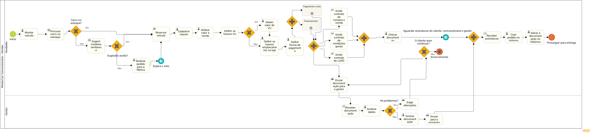

### 3.3.1 Processo 1 – Venda do Veículo

#### Modelo do Processo 1 (Padrão BPMN)

_O processo de venda inicia-se com o cadastro do cliente, seguido pela montagem do veículo desejado (modelo, cor, acessórios, etc.). Em seguida, a disponibilidade do veículo é verificada. Caso esteja disponível, o número do chassi é associado ao cliente e o valor da venda é atribuído. Se o veículo não estiver disponível, modelos alternativos são sugeridos ou um pedido é feito à fábrica dentro de 30 dias. Após a confirmação do veículo, define-se a forma de pagamento, incluindo a avaliação de veículo usado (VU) para abater o valor do novo carro. Dependendo da escolha de pagamento, o processo de financiamento ou pagamento à vista é estabelecido, e o emplacamento é discutido._

_Posteriormente, emitem-se os contratos de compra e venda, de condições gerais e de LGPD, sendo necessária a assinatura tanto do cliente quanto da concessionária. A documentação é verificada simultaneamente e enviada ao gestor para aprovação final. Se o gestor aprovar, o pedido é gerado e toda a documentação é salva no sistema. Caso haja problemas, o gestor pode exigir alterações, e o processo de pagamento é revisado. O ciclo continua até que todas as pendências sejam resolvidas, e então o pagamento é processado._

[Foto do Processo de Venda](https://drive.google.com/file/d/1BWCqgAKtH-BzNMqHlwtzInsJj5lEKYs0/view?usp=sharing)

#### Detalhamento das atividades

- Cadastrar cliente (Nome, CPF, RG, e-mail, Celular, endereço e CEP, data de nascimento); 
- Montagem do veículo (modelo, cor, acessórios, etc.);
- Procurar carro no estoque;
- Caso encontrado, reservar o número do Chassis para cliente; 
- Caso contrário, sugerir modelos similares e/ou realizar pedido para a fábrica (demora em média 30 dias para chegar);
- Atribuir um valor à venda;
- Definir forma de pagamento: definir se haverá VU(veículo usado), se existir, iniciar sub processo "Avaliação de Veículo Usado" para que o preço seja abatido do valor total do veículo novo. Definir se haverá financiamento ou se será à vista;
- Definir se haverá emplacamento na loja;
- Emitir paralelamente contrato de compra e venda, de condições gerais, de LGPD, checa-se os documentos e aguardar assinatura do cliente e concessionária;
- Paralelo a isso, aguardar validação e assinatura do gestor;
- Após a aprovação, são recolhidas as assinaturas, o pedido é criado e toda a documentação é salva no histórico do pedido;
- Caso o gestor não aprove algo (geralmente o preço), ele pode exigir alterações, e todo o processo a partir da definição de forma de pagamento se repete;

_Os tipos de dados a serem utilizados são:_

### Área de texto - campo texto de múltiplas linhas
- **Endereço** (pode exigir mais detalhes do cliente)
  
### Caixa de texto - campo texto de uma linha
- **Nome**
- **CPF**
- **RG**
- **E-mail**
- **Celular**
- **CEP**
- **Modelo do veículo**
- **Cor do veículo**
- **Chassi**
  
### Número - campo numérico
- **Valor da venda** (preço total do veículo)
  
### Data - campo do tipo data (dd-mm-aaaa)
- **Data de nascimento do cliente**
- **Data de chegada do pedido (estimada, 30 dias)**

### Hora - campo do tipo hora (hh:mm:ss)
- Não aplicável diretamente neste cenário.

### Data e Hora - campo do tipo data e hora (dd-mm-aaaa, hh:mm:ss)
- **Data e hora da assinatura do cliente**
- **Data e hora da assinatura do gestor**

### Imagem - campo contendo uma imagem
- **Imagem do veículo**

### Seleção única - campo com várias opções de valores que são mutuamente exclusivas (radio button ou combobox)
- **Forma de pagamento**: opções (À vista, Financiamento)
- **Emplacamento**: opções (Sim, Não)

### Seleção múltipla - campo com várias opções que podem ser selecionadas mutuamente (checkbox ou listbox)
- **Acessórios do veículo**: opções (ar-condicionado, teto solar, etc.)
  
### Arquivo - campo de upload de documento
- **Contrato de compra e venda**
- **Condições gerais**
- **LGPD**
  
### Link - campo que armazena uma URL
- **Link para o histórico do pedido** (página que armazena detalhes do pedido)

### Tabela - campo formado por uma matriz de valores
- **Tabela de avaliação do veículo usado (VU)**: incluindo itens como modelo, ano, quilometragem, etc.

Aqui estão as atividades divididas de acordo com o formato de tabela solicitado:

### **Atividade 1: Cadastro do Cliente**

| **Campo**            | **Tipo**         | **Restrições**                | **Valor default** |
| ---                  | ---              | ---                           | ---               |
| Nome                 | Caixa de texto   | Máximo de 100 caracteres       | string            |
| CPF                  | Caixa de texto   | Formato de CPF (###.###.###-##)| string            |
| RG                   | Caixa de texto   | Máximo de 15 caracteres        | string            |
| E-mail               | Caixa de texto   | Formato de e-mail              | string            |
| Celular              | Caixa de texto   | Formato de telefone (##) #####-#### | string      |
| Endereço             | Área de texto    | Máximo de 300 caracteres       | string            |
| CEP                  | Caixa de texto   | Formato de CEP (#####-###)     | string            |
| Data de nascimento   | Data             | Maior de 18 anos               | Date              |

| **Comandos**           | **Destino**                     | **Tipo**  |
|------------------------|---------------------------------|-----------|
| Envio dos dados pessoais do cliente | Banco de dados do sistema | default |

### **Atividade 2: Montagem do Veículo**

| **Campo**           | **Tipo**             | **Restrições**            | **Valor default** |
| ---                 | ---                  | ---                       | ---               |
| Modelo              | Caixa de texto       | Máximo de 50 caracteres    | string            |
| Cor                 | Caixa de texto       | Máximo de 30 caracteres    | string            |
| Acessórios          | Seleção múltipla     | Selecionar até 5 opções    | null                |
| Imagem do veículo   | Imagem               | Formato .jpg ou .png       | null              |

| **Comandos**           | **Destino**                     | **Tipo**  |
|------------------------|---------------------------------|-----------|
| Envio dos parâmetros de veiculo requisitados | Estoque de veículos da consecionária | default |

### **Atividade 3: Procurar Carro no Estoque**

| **Campo**           | **Tipo**         | **Restrições**          | **Valor default** |
| ---                 | ---              | ---                     | ---               |
| Chassi              | Caixa de texto   | Máximo de 17 caracteres  | string            |
| Modelos Similares   | Seleção múltipla | Selecionar até 3 modelos | null                |

| **Comandos**           | **Destino**                     | **Tipo**  |
|------------------------|---------------------------------|-----------|
| Busca de veículos | Avaliação do cliente  | default |

### **Atividade 4: Definir Forma de Pagamento e Associar Veículo**

| **Campo**              | **Tipo**           | **Restrições**          | **Valor default** |
| ---                    | ---                | ---                     | ---               |
| Valor da venda         | Número             | Valor em reais (R$)     | double             |
| Forma de pagamento     | Seleção única      | À vista, Financiamento   | string            |
| Emplacamento na loja   | Seleção única      | Sim, Não                | boolean            |
| Avaliação do veículo usado (VU) | Tabela     | Contém modelo, ano, quilometragem | [] |

| **Comandos**           | **Destino**                     | **Tipo**  |
|------------------------|---------------------------------|-----------|
| Definição da forma de pagamento | Setor Financeiro/Banco (Caso Financiamento) | default |

### **Atividade 5: Contrato e Aprovação**

| **Campo**                           | **Tipo**          | **Restrições**           | **Valor default** |
| ---                                 | ---               | ---                      | ---               |
| Contrato de compra e venda          | Arquivo           | Formato .pdf             | null              |
| Contrato de condições gerais        | Arquivo           | Formato .pdf             | null              |
| Contrato de LGPD                                | Arquivo           | Formato .pdf             | null              |
| Data e hora da assinatura do cliente | Data e Hora      | -                        | DateTime.now()    |
| Data e hora da assinatura do gestor | Data e Hora       | -                        | DateTime.now()    |

| **Comandos**           | **Destino**                     | **Tipo**  |
|------------------------|---------------------------------|-----------|
| Impressão dos contratos correspondentes| Assinatura do Cliente/ Autorização do Gestor | default |

### **Atividade 6: Criação e Histórico do Pedido**

| **Campo**                         | **Tipo**           | **Restrições**           | **Valor default** |
| ---                               | ---                | ---                      | ---               |
| Histórico do pedido               | Link               | URL válida               | ""                |
| Documentação salva no histórico   | Arquivo            | Formato .pdf             | null              |

| **Comandos**           | **Destino**                     | **Tipo**  |
|------------------------|---------------------------------|-----------|
| Gerar histórico do pedido | Bnaco de Dados do Sistema | default |
