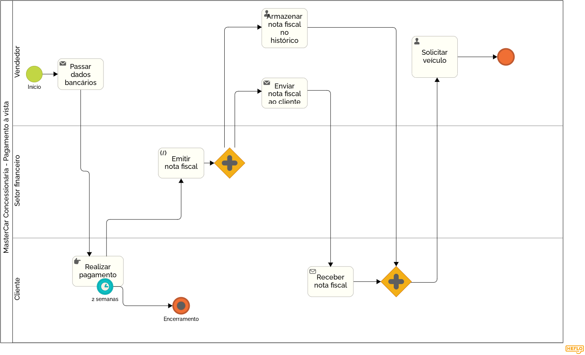

### 3.3.2 Processo 2 – Pagamento (à vista)

#### Modelo do Processo 2 (Padrão BPMN)

_Esse processo mostra o pagamento (à vista), desde a passagem dos dados bancários da concessionária para o cliente, a realização do pagamento por parte do mesmo, as atividades jurídicas realizadas pelo setor financeiro, a troca de informações finais sobre as notas fiscais, validando a conclusão e por fim a solicitação do veículo para o setor logístico._

[Foto do Processo de Pagamento (à vista)](https://drive.google.com/file/d/1xnJCgk2Bu8tqxcWtvlLbq8gIAknnqcMt/view?usp=sharing)

#### Detalhamento das atividades

Caso haja um VU, o valor abatido já terá sido definido. Então o pagamento será apenas do valor inicialmente combinado.
- Passar dados bancários (vendedor)
- Realizar pagamento (cliente)
- Emitir Nota Fiscal (setor financeiro)
- Armazenar nota fiscal do histórico do pedido (vendedor)
- Enviar nota fiscal ao cliente (vendedor)
- Receber nota fiscal (cliente)
- Solicitar Veiculo (vendedor)
- Proceder para a entrega (vendedor)

_Os tipos de dados a serem utilizados são:_
  
### Caixa de texto - campo texto de uma linha
- **Numero da conta**
- **Agência**
- **Marca**
- **Modelo**
- **Ano**
  
### Arquivo - campo de upload de documento
- **Comprovante de pagamento**
- **Confirmação do pagamento**
- **Emissão da nota fiscal**
- **Nota Fiscal do Pagamento**
- **Solicitação do veículo**
- **Liberação para entrega**

### Atividade 1: Passar dados bancários

| **Campo**            | **Tipo**         | **Restrições**          |
| ---                  | ---              | ---                     |
| Numero da conta      | Caixa de texto   | Máximo de 20 caracteres |
| Agência              | Caixa de texto   | Máximo de 10 caracteres |

| **Comandos**           | **Destino**                     | **Tipo**  |
|------------------------|---------------------------------|-----------|
| Envio dos dados bancários | meio de contato do Cliente | default |

### Atividade 2: Realizar pagamento

| **Campo**       | **Tipo**         | **Restrições** |
| ---             | ---              | ---            |
| Comprovante de pagamento | Arquivo  | Formato .pdf    |

| **Comandos**           | **Destino**                     | **Tipo**  |
|------------------------|---------------------------------|-----------|
| Realização do Pagamento e envio do comprovante | Setor financeiro da concessionária  | default |

### Atividade 3: Emitir Nota Fiscal

| **Campo**       | **Tipo**         | **Restrições** |
| ---             | ---              | ---            |
| Confirmação do pagamento | Arquivo  | Formato .pdf  |
| Emissão da nota fiscal | Arquivo  | Formato .pdf    |

| **Comandos**           | **Destino**                     | **Tipo**  |
|------------------------|---------------------------------|-----------|
| Emissão e envio da nota fiscal | meio de contato do Vendedor | default   |

### Atividade 4: Armazenar nota fiscal do histórico do pedido

| **Campo**       | **Tipo**         | **Restrições** |
| ---             | ---              | ---            |
| Nota Fiscal do Pagamento | Arquivo  | Formato .pdf    |

| **Comandos**           | **Destino**                     | **Tipo**  |
|------------------------|---------------------------------|-----------|
| Realizar armazeno da nota fiscal no sistema | Módulo do sistema responsável pelo armazenamento de nota fiscal | default   |

### Atividade 5: Enviar nota fiscal ao cliente

| **Campo**       | **Tipo**         | **Restrições** |
| ---             | ---              | ---            |
| Nota Fiscal do Pagamento| Arquivo  | Formato .pdf    |

| **Comandos**           | **Destino**                     | **Tipo**  |
|------------------------|---------------------------------|-----------|
| Enviar nota fiscal     | meio de contato do Cliente | default   |

### Atividade 6: Receber nota fiscal

| **Campo**       | **Tipo**         | **Restrições** |
| ---             | ---              | ---            |
| Nota Fiscal do Pagamento | Arquivo  | Formato .pdf    |

| **Comandos**           | **Destino**                     | **Tipo**  |
|------------------------|---------------------------------|-----------|
| Receber nota fiscal do Vendedor | Meio/local de armazenamento de documentos do Cliente | default   |

### Atividade 7: Solicitar Veículo

| **Campo**       | **Tipo**         | **Restrições** |
| ---             | ---              | ---            |
| Solicitação do veículo | Arquivo  | Formato .pdf    |
| Marca | Caixa de texto | máximo de 50 caracteres |
| Modelo | Caixa de texto | máximo de 30 caracteres |
| Ano | Caixa de texto | máximo de 4 caracteres |

| **Comandos**           | **Destino**                     | **Tipo**  |
|------------------------|---------------------------------|-----------|
| Solicitar Veículo para o Cliente | Proceder para a entrega do Veículo | default   |

### Atividade 8: Proceder para a entrega

| **Campo**       | **Tipo**         | **Restrições** |
| ---             | ---              | ---            |
| Liberação para entrega | Arquivo  | Formato .pdf    |

| **Comandos**           | **Destino**                     | **Tipo**  |
|------------------------|---------------------------------|-----------|
| Proceder para a entrega do veiculo | Processo de entrega do veiculo | default   |
