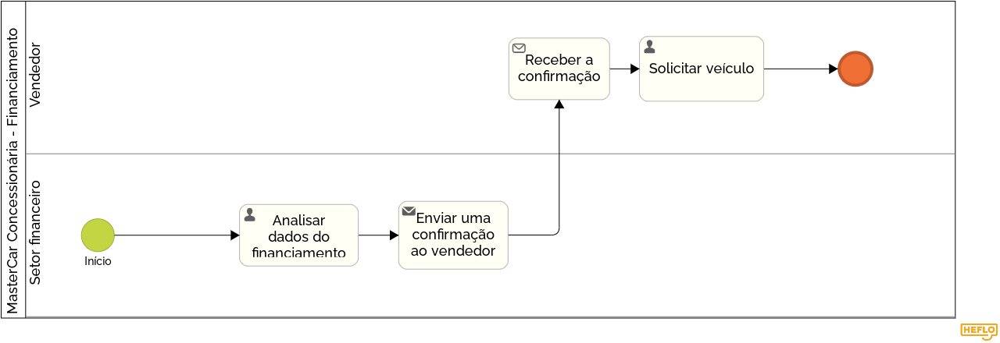

### 3.3.3 Processo 3 – Financiamento

#### Modelo do Processo 3 (Padrão BPMN)

_O processo de financiamento de automóveis começa com o preenchimento da ficha de cadastro do cliente pelo vendedor, contendo informações pessoais e financeiras. Após isso, o setor financeiro analisa os dados do financiamento e, se aprovados, envia uma confirmação ao vendedor. O vendedor, então, solicita o veículo e procede com a entrega ao cliente, encerrando o processo._

[Foto do Processo de Financiamento](https://drive.google.com/file/d/1Rlf64uewCfp9ihY1gmRPLowl_wNXqYdo/view?usp=sharing)

#### Detalhamento das atividades

- Preenchimento de ficha de cadastro (dados pessoais, profissionais, renda, referências pessoais, comerciais e bancárias); (vendedor preenche no sistema)
- Análise do banco;
- Enviar confirmação para o vendedor;
- Solicitação do veículo (vendedor);
- Proceder para entrega;

Os tipos de dados a serem utilizados são:

### Área de texto - campo texto de múltiplas linhas
- **Preenchimento de ficha de cadastro**: dados pessoais, profissionais, renda, referências pessoais, comerciais e bancárias.

### Caixa de texto - campo texto de uma linha
- **Emissão da solicitação do veículo**

### Numérico - campo numérico
- (Nenhum dado específico no texto se encaixa diretamente aqui)

### Seleção única
- **Análise dos dados do financiamento e aprovação ou rejeição**

### Data - campo do tipo data (dd-mm-aaaa)
- (Nenhum dado específico no texto se encaixa diretamente aqui)

### Hora - campo do tipo hora (hh:mm:ss)
- (Nenhum dado específico no texto se encaixa diretamente aqui)

### Data e Hora - campo do tipo data e hora (dd-mm-aaaa, hh:mm:ss)
- (Nenhum dado específico no texto se encaixa diretamente aqui)

### Imagem - campo contendo uma imagem
- (Nenhum dado específico no texto se encaixa diretamente aqui)

### Seleção única - campo com várias opções de valores que são mutuamente exclusivas (radio button ou combobox)
- **Análise do banco**
- **Aprovação do crédito do cliente**

### Seleção múltipla - campo com várias opções que podem ser selecionadas mutuamente (checkbox ou listbox)
- (Nenhum dado específico no texto se encaixa diretamente aqui)

### Arquivo - campo de upload de documento
- (Nenhum dado específico no texto se encaixa diretamente aqui)

### Link - campo que armazena uma URL
- (Nenhum dado específico no texto se encaixa diretamente aqui)

### Tabela - campo formado por uma matriz de valores
- (Nenhum dado específico no texto se encaixa diretamente aqui)
  

### **Atividade 1: Preenchimento de ficha de cadastro**

| **Campo**                      | **Tipo**         | **Restrições**                | **Valor default** |
| ---                            | ---              | ---                           | ---               |
| Dados pessoais                 | Caixa de texto   | Máximo de 300 caracteres      | string            |
| Dados profissionais            | Caixa de texto   | Máximo de 300 caracteres      | string            |
| Renda                          | Caixa de texto   | Formato de valor monetário    | string            |
| Referências pessoais           | Caixa de texto   | Máximo de 300 caracteres      | string            |
| Referências comerciais         | Caixa de texto   | Máximo de 300 caracteres      | string            |
| Referências bancárias          | Caixa de texto   | Máximo de 300 caracteres      | string            |

| **Comandos**              | **destino**                     | **Tipo** |
|---                        |---                              |---       |
| Enviar ficha para análise | Próxima etapa: Análise do banco | default  |

---

### **Atividade 2: Análise do banco**

| **Campo**                      | **Tipo**         | **Restrições**                      | **Valor default** |
| ---                            | ---              | ---                                 | ---               |
| Análise do banco               | Seleção única    | Opções como 'Aprovado', 'Rejeitado' | boolean           |

| **Comandos**       | **destino**                                   | **Tipo** |
| ---                | ---                                           | ---      |
| Enviar confirmação | Próxima etapa: Enviar confirmação ao vendedor | default  |

---

### **Atividade 3: Enviar confirmação para o vendedor**
| **Campo**                      | **Tipo**         | **Restrições**                | **Valor default** |
| ---                            | ---              | ---                           | ---               |
| Status de confirmação          | Seleção única    | Opções: 'Enviado', 'Pendente' | boolean           |
| Data de envio                  | Data             | Formato dd-mm-aaaa            | date              |
| Hora de envio                  | Hora             | Formato hh:mm:ss              | time              |
| Canal de envio                 | Caixa de texto   | Máximo de 300 caracteres      | string            |

| **Comandos**                  | **destino**                           | **Tipo** |
| ---                           | ---                                   | ---      |
| Enviar solicitação de veículo | Próxima etapa: Solicitação do veículo | default  |

---

### **Atividade 4: Solicitação do veículo**

| **Campo**                      | **Tipo**         | **Restrições**                | **Valor default** |
| ---                            | ---              | ---                           | ---               |
| Modelo do veículo              | Caixa de texto   | Máximo de 50 caracteres       | string            |
| Cor do veículo                 | Caixa de texto   | Máximo de 30 caracteres       | string            |
| Chassi                         | Caixa de texto   | Máximo de 17 caracteres       | string            |
| Data da solicitação            | Data             | Formato dd-mm-aaaa            | date              |
| Hora da solicitação            | Hora             | Formato hh:mm:ss              | time              |
| Setor da solicitação           | Caixa de texto   | Máximo de 300 caracteres      | string            |

| **Comandos**          | **destino**                          | **Tipo** |
| ---                   | ---                                  | ---      |
| Confirmar solicitação | Próxima etapa: Proceder para entrega | default  |

---

### **Atividade 5: Proceder para entrega**

| **Campo**                      | **Tipo**         | **Restrições**                      | **Valor default** |
| ---                            | ---              | ---                                 | ---               |
| Proceder para entrega          | Seleção única    | Opções como 'Concluído', 'Pendente' | boolean           |

| **Comandos**     | **destino**                      | **Tipo** |
| ---              | ---                              | ---      |
| Concluir entrega | Fim do processo de financiamento | default  |
