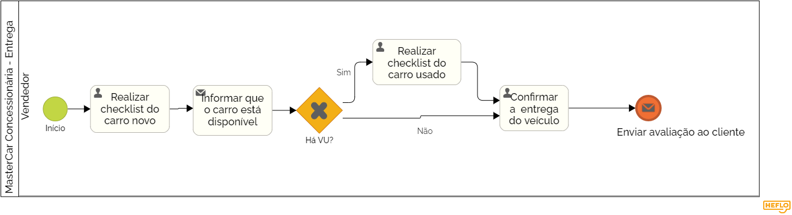

### 3.3.4 Processo 4 – Entrega do Veículo

#### Modelo do Processo 4 (Padrão BPMN)

_O processo de entrega na concessionária MasterCar envolve uma sequência de passos que garante que o cliente receba seu veículo novo ou usado em condições adequadas. Inicialmente, o vendedor realiza um checklist detalhado no carro novo para verificar se tudo está em ordem. Após a confirmação de que o veículo está pronto, o cliente é informado de sua disponibilidade para retirada. Isso garante que o cliente receba o veículo no estado prometido, criando confiança na qualidade do serviço prestado pela concessionária.

Caso o cliente tenha um veículo usado envolvido na negociação, o vendedor também realiza um checklist no carro usado para avaliar sua condição antes da finalização da transação. Se tudo estiver conforme, a entrega do veículo é confirmada ao cliente, concluindo o processo de venda._

[Foto do Processo de Entrega do Veículo](https://drive.google.com/file/d/1g5QMvTl916zixWiMOLngM60efHvG_4qg/view?usp=sharing)

#### Detalhamento das atividades
- Vendedor emite ordem de entrega
- Realizar Checklist do Carro Novo
- Informar Carro Disponível
- Realizar Checklist do Carro Usado
- Confirmar Entrega do Veículo

---

### **Atividade 1: Realizar Checklist do Carro Novo**

| **Campo**              | **Tipo**        | **Restrições**                 | **Valor default** |
|------------------------|-----------------|--------------------------------|-------------------|
| Número do chassi       | Caixa de texto  | Máximo de 17 caracteres        | string            |
| Data do checklist      | Data e Hora     | Data do checklist              | DateTime.now()    |
| Responsável            | Caixa de texto  | Máximo de 100 caracteres       | string            |
| Status do checklist    | Seleção única   | Aprovado, Reprovado            |boolean          |

| **Comandos**           | **Destino**                      | **Tipo**   |
|------------------------|----------------------------------|------------|
| Realizar checklist     | Próxima atividade: Informar carro disponível | default   |

---

### **Atividade 2: Informar Carro Disponível**

| **Campo**              | **Tipo**        | **Restrições**                 | **Valor default** |
|------------------------|-----------------|--------------------------------|-------------------|
| Data da disponibilidade| Data e Hora     | Data de envio da informação    | DateTime.now()    |
| Canal de comunicação   | Seleção única   | E-mail, SMS, ligação           | string            |
| Nome do cliente        | Caixa de texto  | Máximo de 100 caracteres       | string            |

| **Comandos**           | **Destino**                      | **Tipo**   |
|------------------------|----------------------------------|------------|
| Informar disponibilidade| Próxima atividade: Verificação de VU | default   |

---

### **Atividade 3: Realizar Checklist do Carro Usado**

| **Campo**              | **Tipo**        | **Restrições**                 | **Valor default** |
|------------------------|-----------------|--------------------------------|-------------------|
| Número do chassi       | Caixa de texto  | Máximo de 17 caracteres        | string            |
| Data do checklist      | Data e Hora     | Data do checklist              | DateTime.now()    |
| Responsável            | Caixa de texto  | Máximo de 100 caracteres       | string            |
| Status do checklist    | Seleção única   | Aprovado, Reprovado            | boolean          |

| **Comandos**           | **Destino**                      | **Tipo**   |
|------------------------|----------------------------------|------------|
| Realizar checklist      | Próxima atividade: Confirmar entrega | default   |

---

### **Atividade 4: Confirmar Entrega do Veículo**

| **Campo**              | **Tipo**        | **Restrições**                 | **Valor default** |
|------------------------|-----------------|--------------------------------|-------------------|
| Nome do cliente        | Caixa de texto  | Máximo de 100 caracteres       | string            |
| Data da entrega        | Data e Hora     | Data da confirmação de entrega | DateTime.now()    |
| Responsável            | Caixa de texto  | Máximo de 100 caracteres       | string            |

| **Comandos**           | **Destino**                      | **Tipo**   |
|------------------------|----------------------------------|------------|
| Confirmar entrega       | Fim do processo                 | default   |

---

