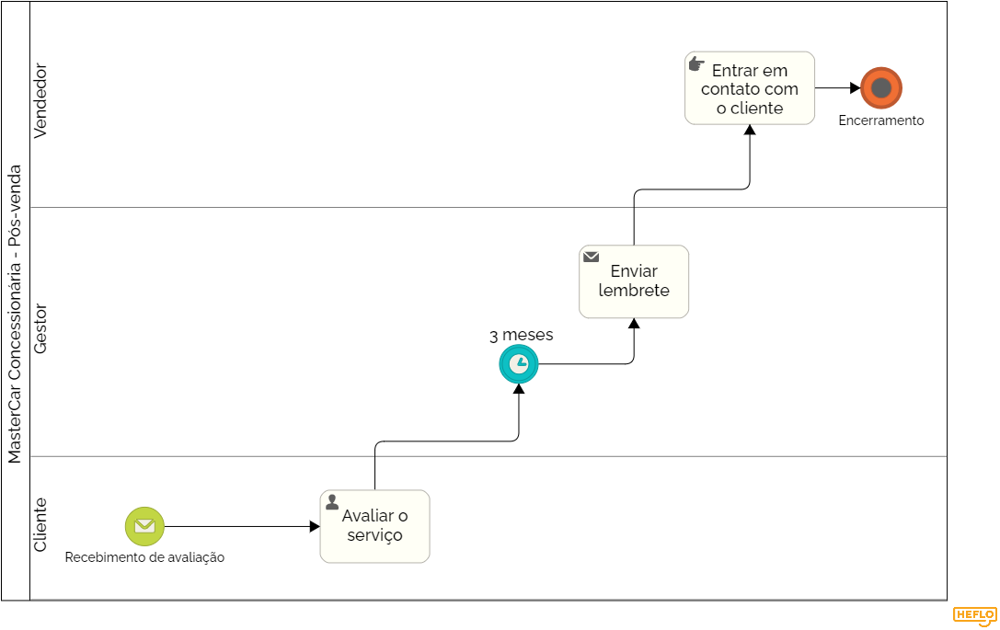

### 3.3.6 Processo 6 – Pós-Venda

#### Modelo do Processo 6 (Padrão BPMN)

_O último processo, de pós-venda, inicia-se com o recebimento da avaliação, que será realizada pelo cliente. 3 meses depois, acontece o envio de um lembrete ao vendedor, para que este entre em contato com o cliente._

[Foto do Processo de Pós-venda](https://drive.google.com/file/d/1tVGvdYVXN-vPpR6kK8zkBGU9J6Y0GbHq/view?usp=sharing)

#### Detalhamento das atividades

- Recebimento de avaliação (cliente)
- Avaliar o serviço (cliente)
- Enviar lembrete (gestor)
- Entrar em contato com o cliente (vendedor)

_Os tipos de dados a serem utilizados são:_

### Área de texto - campo texto de múltiplas linhas
- **Observações** (na atividade de pós-venda e contato com o cliente)
  
### Caixa de texto - campo texto de uma linha
- **Nome do cliente**
- **Nome do vendedor**
  
### Data - campo do tipo data (dd-mm-aaaa)
- **Data de avaliação**
- **Data da ligação**
- **Data do lembrete**

### Seleção única - campo com várias opções de valores que são mutuamente exclusivas (radio button ou combobox)
- **Avaliação do vendedor** (1 a 5 estrelas)
- **Avaliação da concessionária** (1 a 5 estrelas)

Aqui estão as atividades divididas de acordo com o formato de tabela solicitado:

### **Atividade 1: Avaliar o serviço**

| **Campo**              | **Tipo**            | **Restrições**              | **Valor default** |
|------------------------|---------------------|-----------------------------|-------------------|
| Avaliação do vendedor  | Seleção única       | 1 a 5 estrelas              | 5                 |
| Avaliação da concessionária | Seleção única   | 1 a 5 estrelas             | 5                 |
| Observações            | Área de texto       | Máximo de 300 caracteres    | string            |
| Data da avaliação      | Data e Hora         | -                           | DateTime.now()    |

| **Comandos**           | **Destino**                     | **Tipo**  |
|------------------------|---------------------------------|-----------|
| Enviar avaliação       | Próxima etapa de enviar lembrete | default   |

---

### **Atividade 2: Enviar lembrete**

| **Campo**              | **Tipo**            | **Restrições**              | **Valor default** |
|------------------------|---------------------|-----------------------------|-------------------|
| Nome do vendedor       | Caixa de texto      | Máximo de 100 caracteres    | string            |
| Data do lembrete       | Sata e Hora         | Envio automático após 3 meses | DateTime.now()  |

| **Comandos**           | **Destino**                     | **Tipo**  |
|------------------------|---------------------------------|-----------|
| Enviar lembrete        | Próxima atividade: entrar em contato com o cliente | default   |

---

### **Atividade 3: Entrar em contato com o cliente**

| **Campo**              | **Tipo**            | **Restrições**              | **Valor default** |
|------------------------|---------------------|-----------------------------|-------------------|
| Data do contato        | Data e Hora         | -                           | DateTime.now()    |
| Nome do cliente        | Caixa de texto      | Máximo de 100 caracteres    | string            |
| Nome do vendedor       | Caixa de texto      | Máximo de 100 caracteres    | string            |
| Observações do contato | Área de texto       | Máximo de 300 caracteres    | string            |

| **Comandos**           | **Destino**                     | **Tipo**  |
|------------------------|---------------------------------|-----------|
| Registrar contato      | Fim do processo de pós-venda    | default   |

---
