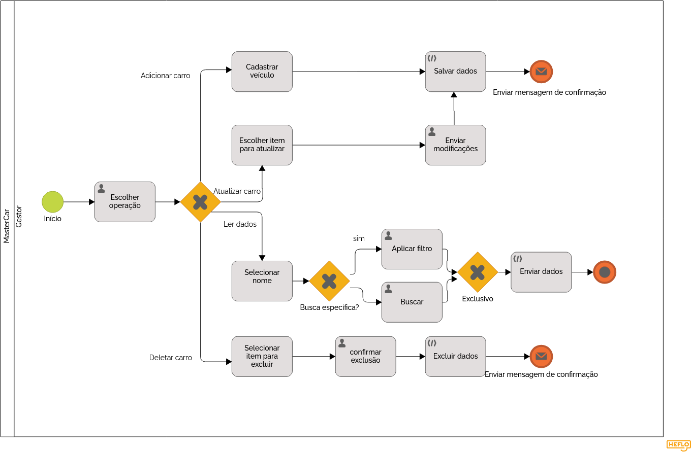

### 3.3.7 Processo 7 – cadastro veículo

#### Modelo do Processo 7 (Padrão BPMN)

_O processo envolve a gestão de carros, onde o usuário pode adicionar, consultar, atualizar e excluir veículos do sistema. Ao adicionar um carro, o usuário insere os dados necessários, como marca, modelo, ano e preço, e o sistema valida essas informações antes de salvar no banco de dados. Quando o usuário deseja consultar veículos, ele pode definir critérios de busca, como modelo ou ano, e o sistema retorna uma lista de carros que atendem a esses filtros. No caso de atualização, o usuário escolhe um veículo já cadastrado, modifica informações como preço ou disponibilidade, e o sistema salva essas alterações após validação. Para exclusão, o usuário seleciona um carro, confirma a ação, e o sistema remove o registro permanentemente. Em cada uma dessas operações, o sistema garante a integridade dos dados e fornece feedback ao usuário, confirmando o sucesso ou falha das ações._

[Foto do Processo de Cadastro](https://drive.google.com/file/d/1C3WpmXsxWeNQ8Kq-NU8WYChoitiR-VYO/view?usp=sharing)

#### Detalhamento das atividades

- Escolher operação, gestor inicia o processo e seleciona qual operação deseja realizar;
- Passar parâmetros: O gestor insere os dados do veículo (como marca, modelo, ano, etc.);
- Salvar dados: As mudanças são salvas no sistema;
- Enviar mensagem de confirmação, o sistema retorna uma mensagem confirmando a ação;
- Escolher item para atualizar: O gestor escolhe o veículo que deseja modificar;
- Enviar modificações, como, atualização de preço, ou detalhes específicos;
- Selecionar nome: O gestor escolhe um nome ou um critério para consultar os veículos;
- Buscar: Se for uma busca mais direta, o sistema recupera os dados com base nos critérios;
- Enviar dados: O sistema retorna os dados solicitados ao gestor, mostrando os veículos que atendem ao critério;
- Selecionar item para excluir: O gestor escolhe o veículo a ser excluído da base de dados;
- Excluir dados: O veículos selecionado é excluidodo sistema.

_Os tipos de dados a serem utilizados são:_

### Caixa de texto - campo texto de uma linha
- **Nome do carro**
- **E-mail**
- **Modelo do veículo**
- **Cor do veículo**
- **Chassi**
- **Ano**
  

### Seleção única - campo com várias opções de valores que são mutuamente exclusivas (buttons)
- **Cadastrar veículo**
- **Editar veículo** 
- **Deletar veículo**
- **Selecionar carro**
- **Salvar dados**

Aqui estão as atividades divididas de acordo com o formato de tabela solicitado:

### **Atividade 1: Escolher operação**

| **Campo**              | **Tipo**            | **Restrições**              | **Valor default** |
|------------------------|---------------------|-----------------------------|-------------------|
| Adicionar veículos  | Seleção única       | Preencher todos parâmetros       | null             |
| Atualizar veículos | Seleção única   | O carro deve existir            | null               |
| Exibir veículos            | Seleção única       | O carro deve existir   | null            |
| Deletar veículos      | Seleção única    | O carro deve existir           | null    |

### **Atividade 2: Passar parâmetros (adicionar carro)**

| **Campo**              | **Tipo**            | **Restrições**              | **Valor default** |
|------------------------|---------------------|-----------------------------|-------------------|
| Nome do carro  | String       | maxímo 10 caracteres       |  null             |
| Modelo do veículo | String  | maxímo 10 caracteres             | null               |
| Cor do veículo            | String     | maxímo 10 caracteres    | null            |
| Chassi    |  Long    | Ter 17 caracteres          | null    |
| Ano    | Integer     | -         | null    |
| Marca      | String    | Conter apenas letras           | null    |
| Imagem      | .jpg ou .jpeg    | O carro deve existir           | null    |
| Placa      | String| Ter 7 caracteres           | null    |
| Estado      |  String     | Conter apenas letras           | null    |

### **Atividade 3: Escolher item para atualizar (atualizar carro)**

| **Campo**              | **Tipo**            | **Restrições**              | **Valor default** |
|------------------------|---------------------|-----------------------------|-------------------|
| Mostrar detalhes carro  | Seleção única      | O carro já deve ter sido adicionado   |   valores do carro selecionado     |

### **Atividade 4: Enviar modificações (atualizar algum parâmetro )**

| **Campo**              | **Tipo**            | **Restrições**              | **Valor default** |
|------------------------|---------------------|-----------------------------|-------------------|
| Nome do carro  | String       | maxímo 10 caracteres       |  null             |
| Modelo do veículo | String  | maxímo 10 caracteres             | null               |
| Cor do veículo            | String     | maxímo 10 caracteres    | null            |
| Chassi    |  Long    | Ter 17 caracteres          | null    |
| Ano    | Integer     | -         | null    |

### **Atividade 5: Salvar dados**

| **Campo**              | **Tipo**            | **Restrições**              | **Valor default** |
|------------------------|---------------------|-----------------------------|-------------------|
| Salvar dados | Seleção Única       | dados preenchidos       |  null             |

### **Atividade 6: Selecionar item para excluir**

| **Campo**              | **Tipo**            | **Restrições**              | **Valor default** |
|------------------------|---------------------|-----------------------------|-------------------|
| Mostrar detalhes carro  | Seleção Única       |  O carro já deve ter sido adicionado      |  valores do carro selecionado      |

### **Atividade 7: Excluir dados**

| **Campo**              | **Tipo**            | **Restrições**              | **Valor default** |
|------------------------|---------------------|-----------------------------|-------------------|
| Excluir dados | Seleção Única       | dados preenchidos       |  null             |

### **Atividade 8: Selecionar nome**

| **Campo**              | **Tipo**            | **Restrições**              | **Valor default** |
|------------------------|---------------------|-----------------------------|-------------------|
| Caixa de texto  | String     | maxímo de 10 caracteres   |   null     |

### **Atividade 9: Aplicar filtro**

| **Campo**              | **Tipo**            | **Restrições**              | **Valor default** |
|------------------------|---------------------|-----------------------------|-------------------|
| Nome do carro  | String       | Algum campo selecionado      |  null             |
| Modelo do veículo | String  | Algum campo selecionado             | null               |
| Cor do veículo            | String     | Algum campo selecionado     | null            |
| Chassi    |  Long    | Algum campo selecionado           | null    |
| Ano    | Integer     | Algum campo selecionado          | null    |

