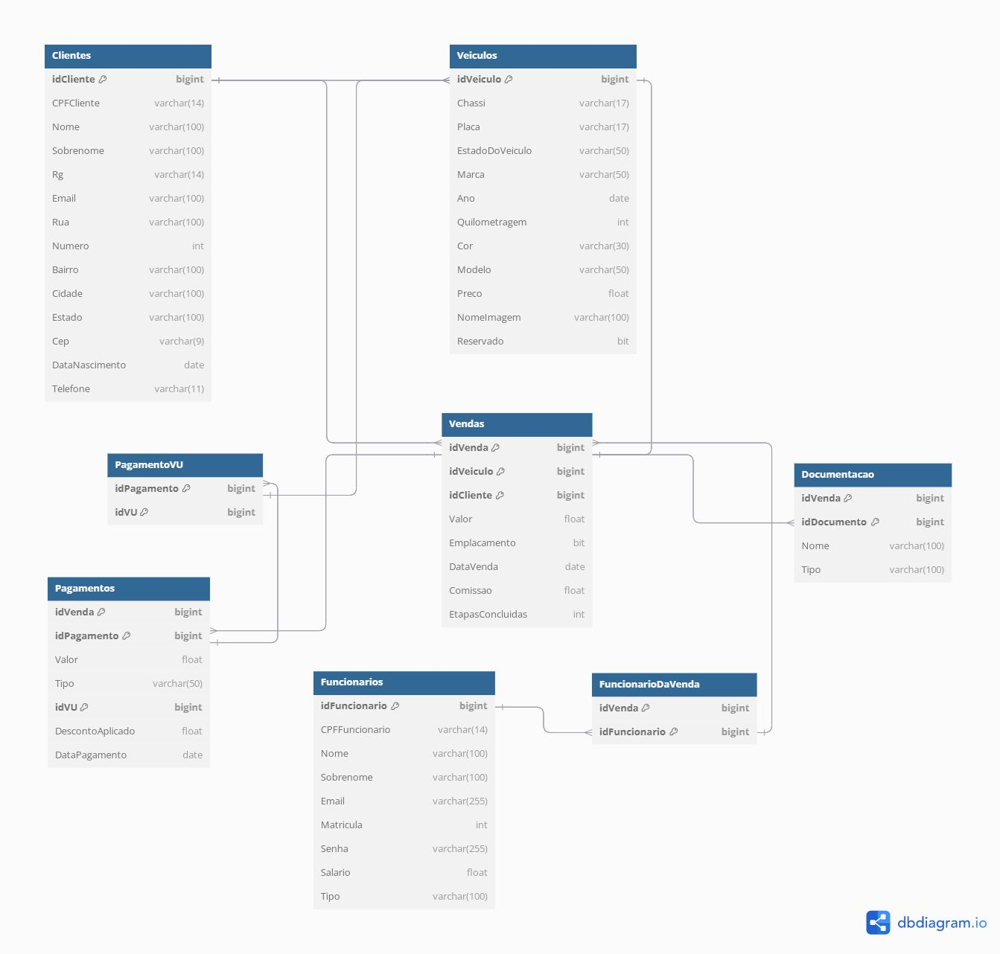

## 4. Projeto da solução

_O documento a seguir apresenta o detalhamento do projeto da solução. São apresentadas duas seções que descrevem, respectivamente: modelo relacional e tecnologias._

### 4.1. Modelo de dados

[Foto da Modelagem de dados da aplicação](https://drive.google.com/file/d/1JfB431moPY5xonksxIdgIdKB7jETl3Tm/view?usp=sharing)

---

### 4.2. Tecnologias

| **Dimensão**   | **Tecnologia**  |
| ---            | ---             |
| SGBD           | SQL Server          |
| Front end      | HTML5, CSS3 e JavaScript|
| Back end       | Java SpringBoot |
| Deploy         | Github Pages    |
|IDEs de desenvolvimento | Visual Studio Code e IntelliJ IDEA|
|Ferramentas | Github Pages, Heflo e Dbdiagram |

