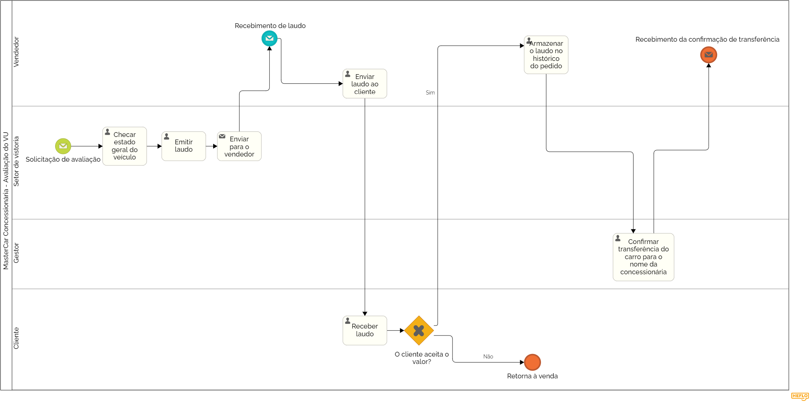

### 3.3.5 Subprocesso 5 – Avaliação do Veiculo Usado

#### Modelo do Subprocesso 5 (Padrão BPMN)

_Esse Subprocesso modela a jornada completa da avaliação do veículo de entrada, começando pela solicitação de avaliação do carro usado pelo vendedor. O veículo passa por uma vistoria para verificar seu estado geral, gerando um laudo que pode ser aceito ou negado pelo cliente, e fica armazenado no histórico do pedido caso o valor seja aceito ou termina o processo caso seja negado. A etapa seguinte envolve a transferência oficial do veículo para o nome da concessionária e termina após sua confirmação._

[Foto do Subprocesso de Avaliação do Veiculo Usado](https://drive.google.com/file/d/1DHu3S2rDwpXAlKCr9Y1rwAyKOPoKxU1O/view?usp=sharing)

#### Detalhamento das atividades

- Solicitar avaliação (vendedor)
- Checar o estado geral do veículo (setor de vistoria)
- Emitir de um laudo para o vendedor (setor de vistoria)
- Enviar laudo para o cliente (vendedor) 
- Decidir se aceita o valor atribuído pelo laudo (cliente)
- Caso o cliente recuse, retornar ao processo de venda 
- Caso o cliente aceite, armazenar o laudo no histórico do pedido (vendedor)
- Confirmar a transferência do carro para o nome da concessionária (gestor) 

**OBS:** O veículo é entregue no dia em que o cliente busca seu novo carro e é feita uma avaliação pela concessionária para checar se o estado do carro ainda condiz com o laudo.

**Participantes:** vendedor, cliente, gestor e setor de vistoria.

### **Atividade 1: Solicitar avaliação**

| **Campo**              | **Tipo**       | **Restrições**              | **Valor default**  |
|------------------------|----------------|-----------------------------|--------------------|
| Número do chassi       | String         | Máximo de 17 caracteres     | null               |
| Placa do carro         | String         | Máximo de 7 caracteres      | null               |
| Data da solicitação    | DateTime       | Data e hora da entrega      | null               |   
| Nome do cliente        | String         | Máximo de 100 caracteres    | null               |
| Nome do vendedor       | String         | Máximo de 100 caracteres    | null               |

| **Comandos**           | **Destino**                            | **Tipo** |
|------------------------|----------------------------------------|----------|
| Transferir             | Início do Subprocesso de transferência | default  |

---

### **Atividade 2: Checar o estado geral do veículo**

| **Campo**                               | **Tipo**         | **Restrições**                               | **Valor default** |
|-----------------------------------------|------------------|----------------------------------------------|-------------------|
| Checklist de fatores a serem analisados | boolean          | todas perguntas devem ter sim ou não marcado | null              |
| Data da vistoria                        | Data e Hora      | -                                            | null              |
| Caixas de observações                   | Caixa de texto   | Máximo de 300 caracteres                     | null              |
| Placa do carro                          | Caixa de texto   | Máximo de 10 caracteres                      | null              |
| Número do pedido                        | Caixa de texto   | Máximo de 30 caracteres                      | null              |

| **Comandos**           | **Destino**                     | **Tipo**  |
|------------------------|---------------------------------|-----------|
| Realizar a vistoria    | Emissão do laudo                | default   |

---

### **Atividade 3: Emitir de um laudo para o vendedor**

| **Campo**              | **Tipo**        | **Restrições**              | **Valor default** |
|------------------------|-----------------|-----------------------------|-------------------|
| Número do pedido       | String          | Máximo de 30 caracteres     | null              |
| Horário de emissão     | DateTime        | Data estimada               | null              |
| E-mail do vendedor     | String          | Máximo de 100 caracteres    | null              |
| Laudo                  | Arquivo         | PDF                         | null              |

---

### **Atividade 4: Enviar laudo para o cliente**

| **Campo**              | **Tipo**       | **Restrições**               | **Valor default**      |
|------------------------|----------------|------------------------------|------------------------|
| E-mail do cliente      | String         | Máximo de 100 caracteres     | null                   |
| Referência do pedido   | String         | Máximo de 30 caracteres      | null                   |
| Data da notificação    | Data e Hora    | Data da notificação enviada  | null                   |
| Laudo                  | Arquivo        | PDF                          | -                      |

| **Comandos**           | **Destino**                         | **Tipo** |
|------------------------|-------------------------------------|----------|
| Notificar cliente      | Tarefa de decisão do valor atribuído| e-mail   |

---

### **Atividade 5: Decidir se aceita o valor atribuído pelo laudo**

| **Campo**              | **Tipo**         | **Restrições**              | **Valor default** |
|------------------------|------------------|-----------------------------|-------------------|
| Data da decisão        | LocalDateTime    | -                           | DateTime.now()    |
| Nome do cliente        | String           | Máximo de 100 caracteres    | null              |
| Nome do vendedor       | String           | Máximo de 100 caracteres    | null              |
| Observações            | String           | Máximo de 300 caracteres    | null              |

| **Comandos**                | **Destino**                         | **Tipo**  |
|-----------------------------|-------------------------------------|-----------|
| Registrar decisão do cliente| Próxima atividade de acompanhamento | mensagem  |

---

### **Atividade 6: Armazenar o laudo no histórico do pedido**

| **Campo**                 | **Tipo**                         | **Restrições**              | **Valor default** |
|---------------------------|----------------------------------|-----------------------------|-------------------|
| Campo de upload de arquivo| Arquivo                          | PDF                         | null              |
| Observações               | String                           | Máximo de 300 caracteres    | null              |
| Data do armazenamento     | LocalDateTime                    | -                           | DateTime.now()    |

| **Comandos**                                      | **Destino**                                | **Tipo**  |
|---------------------------------------------------|--------------------------------------------|-----------|
| Armazenar o laudo na seção de histórico do pedido | Confirmação da transferência do veículo    | Arquivo   |

---

### **Atividade 7: Confirmar a transferência do carro para o nome da concessionária**

| **Campo**              | **Tipo**            | **Restrições**              | **Valor default** |
|------------------------|---------------------|-----------------------------|-------------------|
| Canal de comunicação   | boolean             | true ou false               | false             |
| Observações            | String              | Máximo de 300 caracteres    | null              |
| Data da aprovação      | LocalDateTime       | -                           | DateTime.now()    |

| **Comandos**                                  | **Destino**                     | **Tipo**  |
|-----------------------------------------------|---------------------------------|-----------|
| Enviar notificação de confirmação ao vendedor | Fim do processo de avaliação    | mensagem  |

